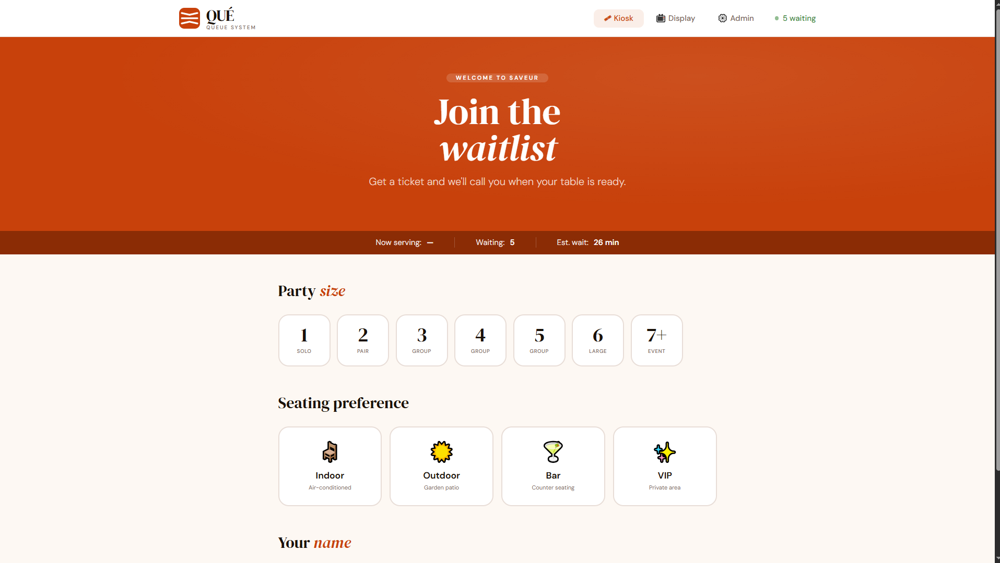
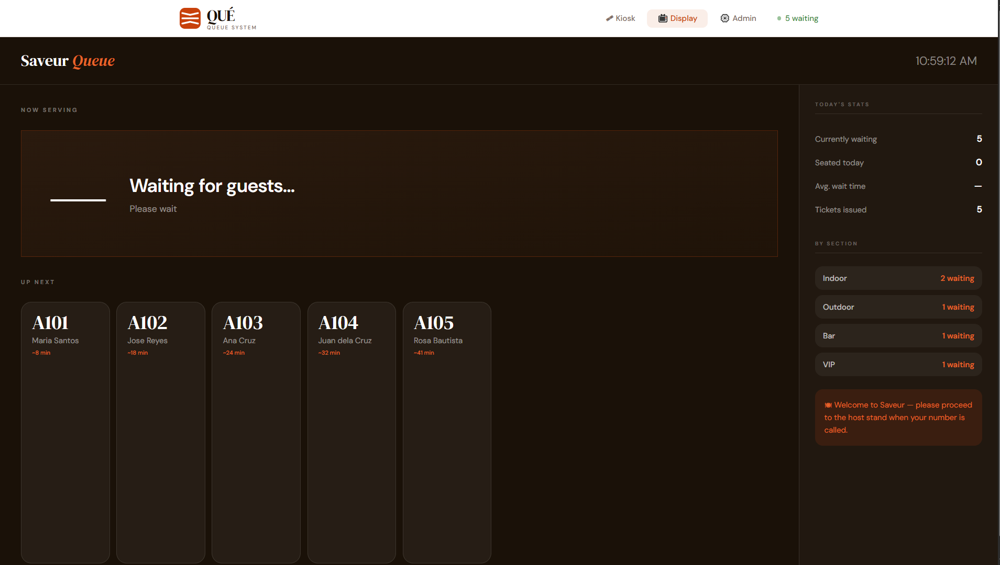
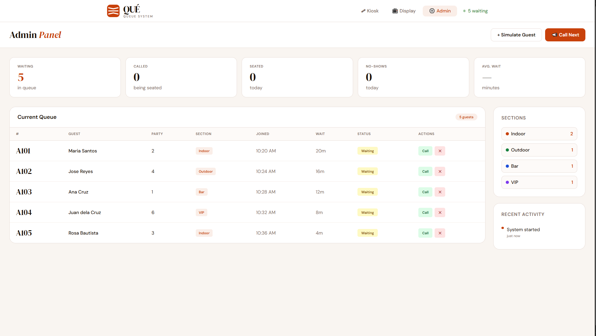

# 🍽️ Restaurant Queing System (Under Development)

[](https://nextjs.org/)
[](https://react.dev/)
[](https://www.typescriptlang.org/)
[](https://tailwindcss.com/)
[](https://dotnet.microsoft.com/)
[](https://axios-http.com/)
[](https://dotnet.microsoft.com/apps/aspnet/signalr)
[](LICENSE)

---

## 📌 Project Description

**Restaurant Queueing System** is a modern web application that helps restaurants manage customer queues, seating, and live waiting lists in real time.

It is built with:

- ⚛️ **Next.js + Tailwind CSS** (Frontend)
- 🧠 **ASP.NET Core Web API** (Backend)

The system provides a fast, responsive, and scalable solution for managing restaurant flow efficiently.

---

## 📸 Screenshot


 <h4 align="center"> Kiosk Page Preview </h4>

 <h4 align="center"> Display Page Preview </h4>

 <h4 align="center"> Admin Page Preview </h4>

---

## ⚡ Features

- 🎟 Kiosk system for customers to join queue
- 📺 Live display screen (Now Serving / Up Next)
- ⚙️ Admin dashboard for staff
- 🪑 Party size selection
- 🍽 Seating preference (Indoor / Outdoor / Bar / VIP)
- 📊 Live queue tracking
- 📣 Call next / manage queue
- ⏱ Estimated wait time
- 📱 Responsive design for tablets & kiosks

---

## 🏗️ Project Structure

```
RestaurantQueueSystem/
├── front-end/   (Next.js + Tailwind CSS)
├── back-end/    (ASP.NET Core Web API)
```

---

## ⚙️ Backend Setup (ASP.NET Core Web API)

### 📁 Go to backend folder

```bash
cd back-end
```

### ▶️ Run backend

```bash
dotnet restore
dotnet run
```

### 🌐 Default API URLs

```
https://localhost:5001
http://localhost:5000
```

---

## 💻 Frontend Setup (Next.js)

### 📁 Go to frontend folder

```bash
cd front-end
```

### 📦 Install dependencies

```bash
npm install
```

### 🚀 Start development server

```bash
npm run dev
```

### 🌐 Open app

```
http://localhost:3000
```

---

## 🔗 API Endpoints (Example)

| Method | Endpoint               | Description         |
| ------ | ---------------------- | ------------------- |
| GET    | `/api/queue`           | Get queue list      |
| POST   | `/api/queue`           | Add guest           |
| PUT    | `/api/queue/call-next` | Call next guest     |
| PUT    | `/api/queue/{id}`      | Update guest status |
| DELETE | `/api/queue/{id}`      | Remove guest        |

---

## 🧠 Tech Stack

### Frontend

- Next.js 14 (App Router)
- React
- TypeScript
- Tailwind CSS
- Axios

### Backend

- ASP.NET Core Web API
- C#
- Entity Framework Core
- SQL Server (or PostgreSQL)

---

## 🚀 Future Improvements

- 🔴 Real-time updates with SignalR
- 📲 QR ticket system for guests
- 📊 Analytics dashboard
- 🔔 SMS / Email notifications
- 🧑‍🍳 Kitchen display system (KDS)

---

## 📄 License

This project is licensed under the MIT License.
